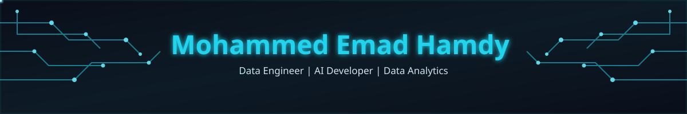
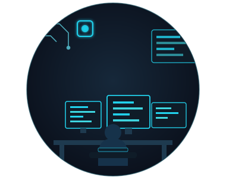

<div align="center">

<!-- ANIMATED CIRCUIT BANNER (local asset) -->


<br/>


</div>

<br/>

## 👨‍💻 About Me

<table>
<tr>
<td width="55%" valign="top">

```yaml
name: Mohammed Emad Hamdy
role: Data Engineer | AI Developer
education: >
  Fourth-year Computer Science & Artificial
  Intelligence Student @ Assiut National University
```

I'm a **Data Engineer** **& Data Analytic** and **AI Developer** passionate about building
robust data-driven solutions, scalable **ETL pipelines**, and turning raw
data into actionable business insights.

**🔭 Current Focus**
- Advanced Data Engineering
- Data Analytics
- Backend AI Systems

**📡 Currently Involved In**
- 🟢 Digital Egypt Pioneers Initiative **(DEPI)** — Data Engineering Track *(Remote)*
- 🏦 **CIB Summer Internship**
- 🤖 **FlyRank AI Internship**
- 💼 **ITIDA** Summer Program

**💬 Let's Talk**
Always open to discuss data infrastructure & AI development.

</td>
<td width="45%" valign="top" align="center">

<!-- ANIMATED CODING ILLUSTRATION (local asset) -->



</td>
</tr>
</table>

<br/>

## 🛠️ Tech Stack & Tools

<table>
<tr>
<td width="34%" valign="top">

### 🗄️ Data Engineering & Analytics


</td>
<td width="33%" valign="top">

### 🧠 AI & Computer Vision


</td>
<td width="33%" valign="top">

### ⚙️ Backend & Tools


</td>
</tr>
</table>

<br/>

## 🚀 Featured Projects

<table>
<tr>
<td width="50%" valign="top">

### ❤️ Heart Disease Prediction ML
Machine learning system that predicts heart disease risk from patient data.

`Python` `Scikit-learn` `Pandas`

[](https://github.com/Mohammed-Emad2004/heart-disease-prediction-ml)

</td>
<td width="50%" valign="top">

### 🗂️ FAT File System Simulator

> A low-level virtual storage simulator replicating **FAT (File Allocation Table)** architecture, cluster chaining, directory hierarchy, and block-level disk I/O operations in C++.

<p align="left">
  
  
  
  
</p>

#### ⚙️ Key Highlights & Implementation
* 📑 **FAT Table & Cluster Chaining:** Replicates table lookup, free-cluster discovery, EOF markers, and linked-block allocation mechanics.
* 📁 **Hierarchical Directory Tree:** Virtual path resolution supporting directory entries, metadata parsing (size, timestamps, attributes), and sub-folder traversal.
* 💾 **Virtual Disk I/O:** Emulates sector-by-sector read/write operations on a virtual container file without risking host file system integrity.
* 💻 **Interactive File System Shell:** Custom CLI providing core commands (`format`, `mkdir`, `touch`, `ls`, `read`, `write`, `rm`, and `dump_fat`).

[](https://github.com/Mohammed-Emad2004/fat-file-system-simulator)

</td>
</tr>
<tr>
<td width="50%" valign="top">

### 🚀 Motorix Programming Language

> **Motorix** is a custom lightweight interpreted programming language and tree-walk interpreter built from scratch.

#### 🛠️ Tech Stack & Concepts
- **Core Languages:** Python / C++
- **Architecture:** Lexical Analysis (Lexer) ➔ Abstract Syntax Tree (AST) ➔ Recursive Descent Parser ➔ Evaluator/Runtime Engine
- **Features:** Scope & Environment Memory Management, Dynamic Type Evaluation, Interactive REPL Shell.

#### 📦 Key Features
* ⚡ **Custom Tokenizer/Lexer:** High-speed tokenization supporting keywords, identifiers, and multi-character operators.
* 🌳 **AST Generation:** Constructing syntax trees with proper operator precedence.
* 💻 **Interactive REPL:** Real-time command-line interface for direct code execution and debugging.
* 🛑 **Detailed Error Reporting:** Syntax and runtime error tracking with line and column numbers.
[](https://github.com/Mohammed-Emad2004/Motorix)

</td>
<td width="50%" valign="top">

### 🕌 Egypt Tourism Website (Flask)
A platform showcasing Egypt's tourist destinations with a data-driven Flask backend.

`Flask` `Python` `SQL`

[](https://github.com/Mohammed-Emad2004/egypt-tourism-website-flask)

</td>
</tr>
</table>

<br/>

## 🏆 GitHub Trophies

<div align="center">

</div>

<br/>

## 📈 GitHub Statistics

<h3 align="center">📊 GitHub Statistics</h3>

<p align="center">
  <!-- كارت الـ Streak اليومي -->
  
</p>

<p align="center">
  <!-- كارت الإحصائيات العامة -->
  
  <!-- كارت أكثر اللغات استخداماً -->
  
</p>

## 🐍 Contribution Snake

<div align="center">

</div>


<br/>

## 💌 Connect With Me

<div align="center">

[](mailto:mohammedemadhamdy142@gmail.com)
[](https://linkedin.com/in/mohammedemadhamdy)
[](https://github.com/Mohammed-Emad2004)

</div>


